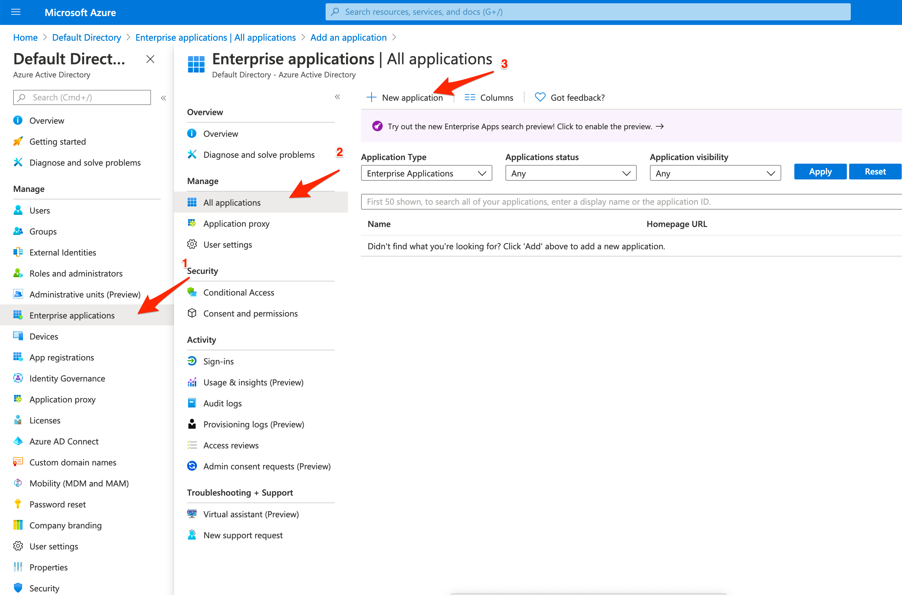
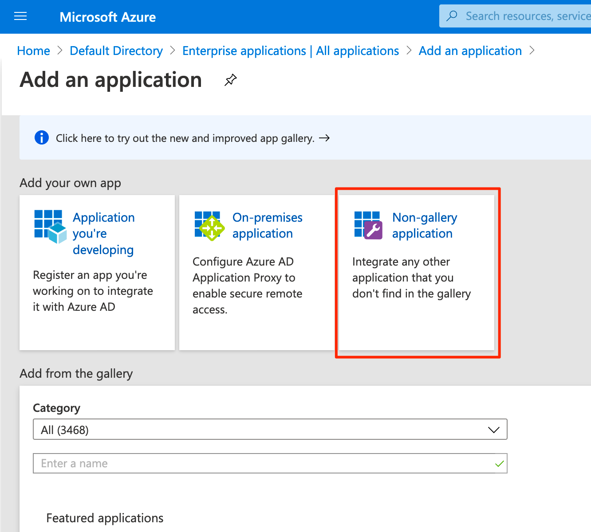
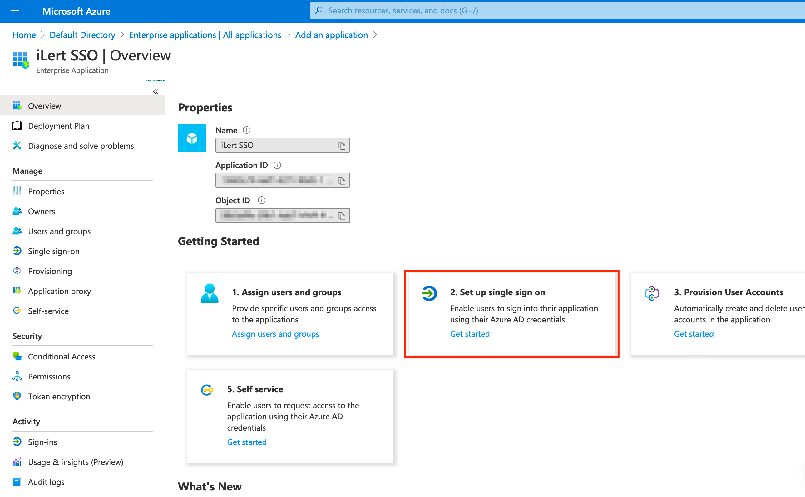
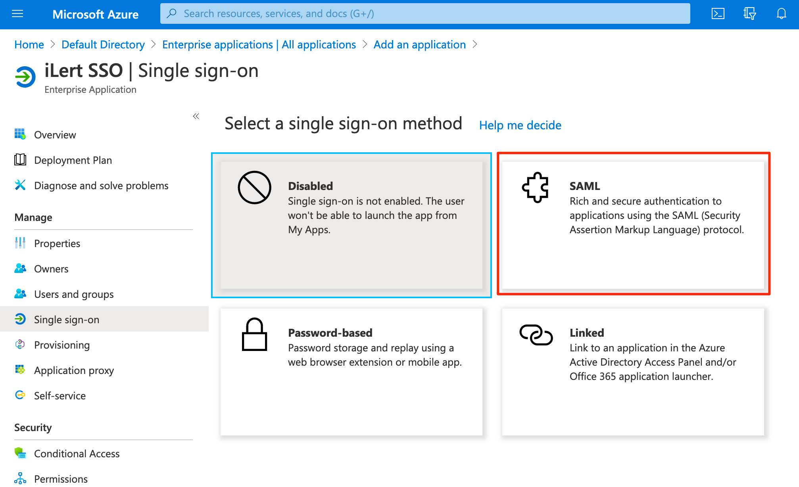
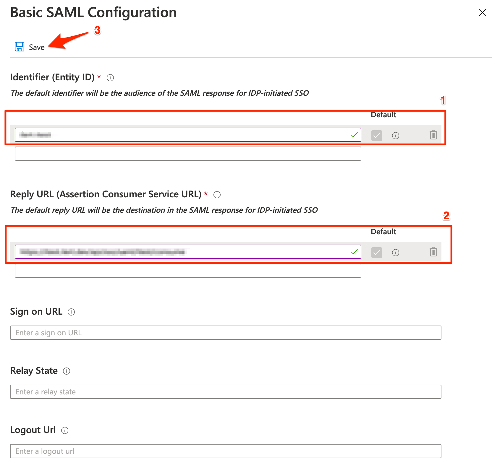
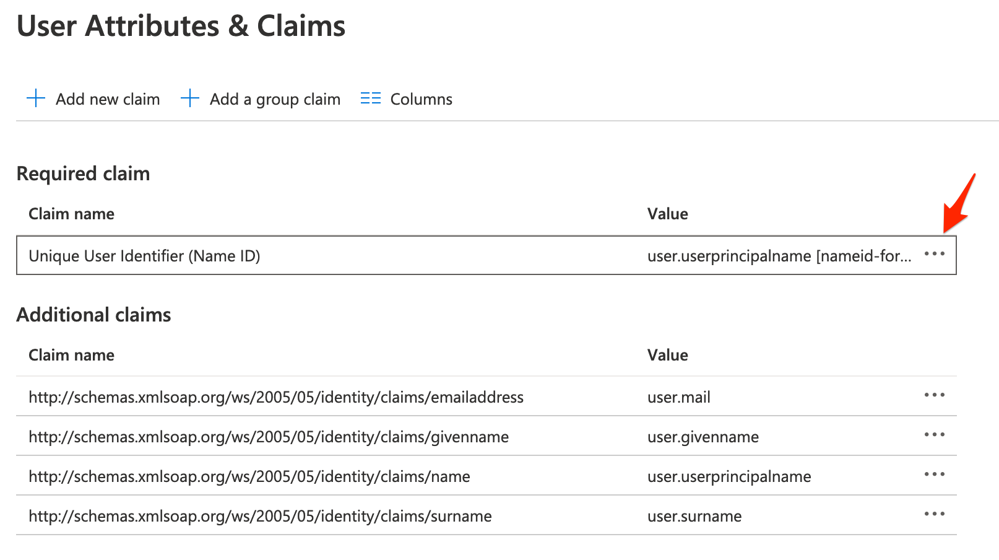
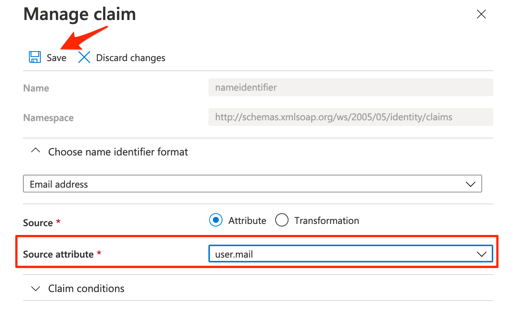
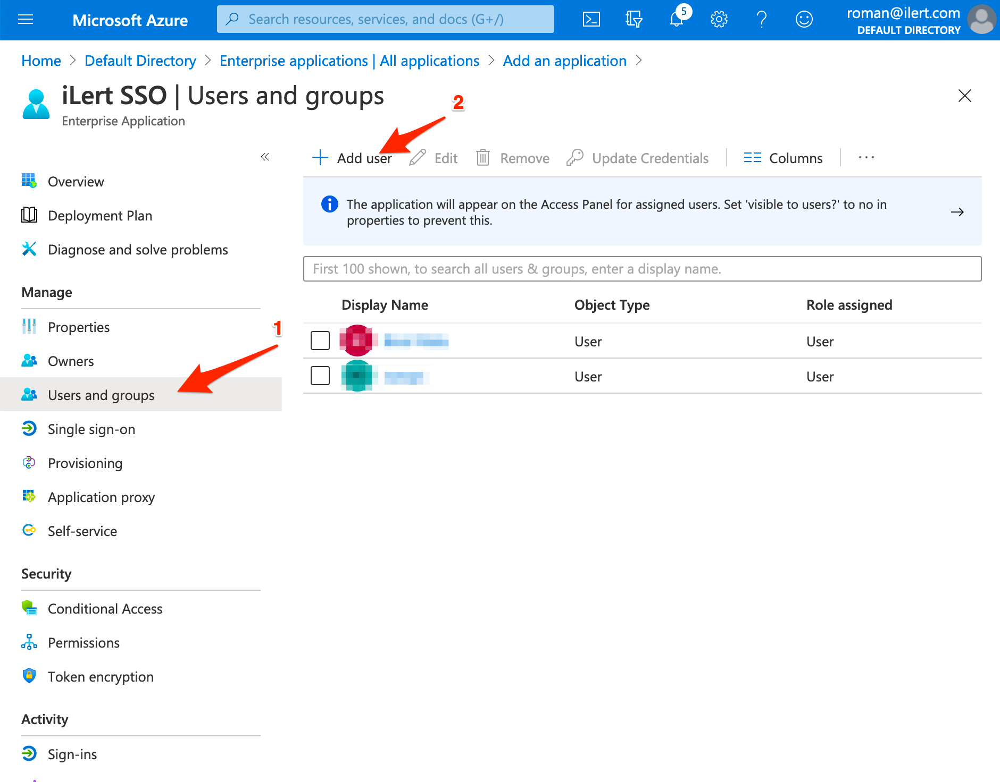
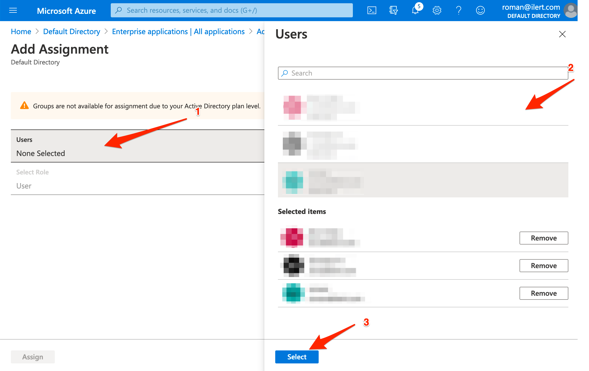
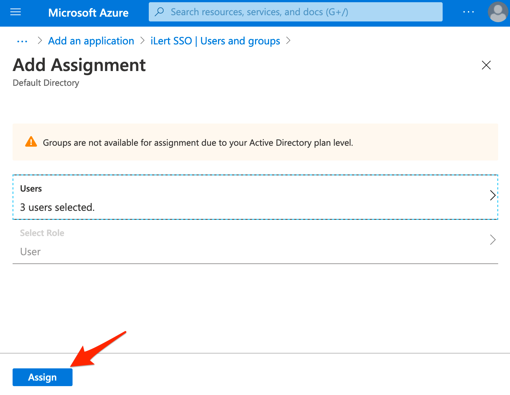

# Setting up SSO with Microsoft Azure Active Directory

When starting with Azure AD Apps things can be a bit complicated and overwhelming. In this guide we take you from zero to your own Azure AD SAML App that integrates with ilert's SSO login.

## Creating an AD Application

Login to your Microsoft Azure Dashboard. Open the directory and create a new application.

From the selection choose a **non gallery application**.

Enter a name and create the application.

.png>)

## Configure your AD App SAML Settings

Configure single sign on for your newly created application.

Choose SAML.

Configure the basic SAML Settings

.png>)

## Setting up SSO in ilert

Log in to your ilert account as **account owner**, navigate to your **Account Settings** (cog right-side navigation) and click on the **Single sign-on** tab.


SSO with SAML requires your account to be on a Premium or Enterprise Plan.


Copy your SAML Endpoint URL and Audience Restriction values into the Azure AD SAML App Basic Configuration.

Save and close the basic SAML settings. Scroll a bit down and copy the 3 values from your AD App, you will have to download the Certificate's Base64 representation and copy the value of its file into ilert's SSO settings certificate field.

.png>)

Transfer the values to ilert's SSO settings.

.png>)

Save the settings on both windows. SSO is now configured, however to make the login process work properly you will have to do 2 more things.

## Adjusting the SAML claim name in Azure AD

To ensure ilert gets passed the correct email of your users from Azure we have to adjust the SAML claim name.

Set the claim name source to `user.mail`.

Save and close the modal.

 copy.png>)

You have now properly adjusted the SAML claim name of your app.

## Adding Azure Users to your Azure AD SAML App

Right now both your ilert account and your Azure AD App are properly configured. However you have not yet added any users to your app, which means no one is able to login currently. Let's change that.

Go to your app's settings and click on **Users and Groups**.

Click on Users and select the users that should be able to login to your ilert account. Confirm the assignment afterwards.

Your users should now be able to login to ilert using their Azure AD accounts.

## Additional SSO Configurations

### Auto-provisioning Azure AD Users in ilert

You can auto-provision users on their first SSO login by enabling the checkbox for **Provision new users on first SSO login** in your ilert account's settings. This way user accounts will be automatically setup with the role **User** in ilert. Optionally, you can also pass in the user's role via custom SAML attributes. See below for more information.

Keep in mind that auto-provisioning new users will require your account to have enough seats booked.

### Disable login with username and password

You can optionally disable the login for username and password combinations on your ilert account and enforce users to use SSO by disabling the checkbox for **Allow login with username and password** in your ilert account's settings.

### Passing additional attributes during auto-provisioning

Besides the `NameID` you may pass additional parameters for the user or the team to be automatically setup on the first login, please check out our [auto provisioning section](auto-provisioning-users-and-teams.md).
